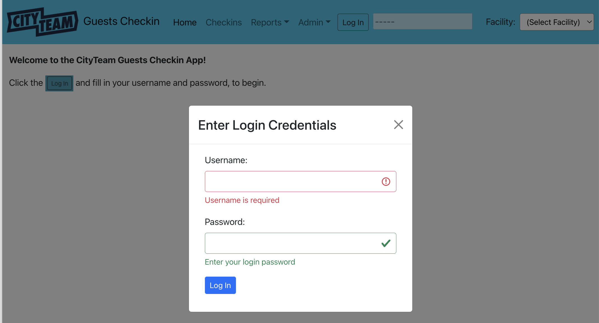

[Home](./index.md) | Introduction | [Overview](./ADMIN-overview.md) | [Facilities](./ADMIN-facilities.md) | [Guests](./ADMIN-guests.md) | [Templates](./ADMIN-templates.md) | [Users](./ADMIN-users.md) | [MERGE Guests](./ADMIN-merge-guests.md)

# Introduction

### How do I get into the application?

You will be using a standard web browser to operate the application.  The URL
to access it will depend on how and where the application is installed.  For
the typical case where it is installed on a laptop computer at the loation
where you will be performing the checkin operations, the URL will usually be:

<strong>http://localhost:8080</strong>

For convenience, whoever is setting up your environment should create
a bookmark in your web browser, so you can just click it.

### OK, I'm Here, what's next?

In order to use the application, you will need to log in with the username
and password assigned to you by your local administrator.  Click the
`Log In` button at the top of the screen, and you will see a way to enter
these credentials:

Enter your assigned username and password, and click the `Log In` button
at the bottom of the form.  If your credentials are correct, you will be
welcomed to the application on it's "Home" page:

In all cases, you must have been granted "admin" permission for the Facility
you want to manage information for.  If you have not been granted this
permission, you will generally be able to see existing information (for the
Facility you have access to), but not be able to change anything.

See [Overview](./ADMIN-overview.md) for a description of the various
types of administrative information that can be managed, and a description
of the way in which nearly all of the administrative pages work.

