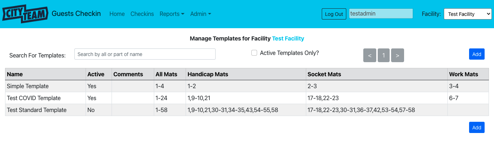

[Home](./index.md) | [Introduction](./ADMIN-introduction.md) | Overview | [Facilities](./ADMIN-facilities.md) | [Guests](./ADMIN-guests.md) | [Templates](./ADMIN-templates.md) | [Users](./ADMIN-users.md) | [MERGE Guests](./ADMIN-merge-guests.md)

# Overview

### Accessing Administrative Pages

All the available administrative pages are listed under the *Admin* topic in the
navigation bar at the top of the screen.  The information below describes the common
technique that can be used on each of these pages to add new information, edit
existing information, or (in some cases) remove existing information.

### Viewing Existing Information

When you pick a particular *Admin* option, you will be shown a page of any
existing information (associated with the CityTeam Facility you have access to)
for that topic.  We will use Templates as an example here just to show you the
style - that particular topic will be discussed in detail on
[it's own page](./ADMIN-templates.md).

At the top of the page, you will typically see the following:
* *Filter Criteria* - you can limit which information is displayed, most often
  by a search bar that displays only rows where the name matches whatever you
  have typed (upper case or lower case does not matter), and by a checkbox that
  lets you request **only** items of this type that are marked as active.
* *Pagination* - In some cases, there will be more possible items than will
  comfortably fit on a single list page.  If that happens, you can use the
  `<` and `>` controls to navigate backwards and forwards through the list.
  These controls will be disabled unless there is more information in that
  direction.
* *Add Button* - You can click this button (repeated at the bottom of the
  list for convenience) to add a new item of this type.  If you are not allowed
  to add new information, these buttons will be disabled.  You will be taken
  to a page showing the detailed fields for a new item, waiting for you to
  fill in the data and click `Save`.

Following these controls, you will see the first page (or only page) listing
all of the matching items of this type.  To manage an existing item (that is,
either edit its information or remove it),  click anywhere in the row for
that item.

### Managing Item Details

When you have clicked on an existing item (or clicked the `Add` button), you
will see the current fields for that item displayed, like this:

Below each field, you will see explanatory notes on what kind of information
goes in each field.  The detailed pages for each information type will also
describe error checks that will be performed -- for example, in nearly every
case the *Name* field must be unique for information of this type, associated
with this Facility.

If you try to enter a value that violates any validation rules (or try to
leave a required field blank), the explanatory comment will be replaced with
an error message describing what is wrong, as soon as you click `Tab` or `Enter`.
You must correct any and all errors before you will be able to click `Save`
in order to add a new item, or update an existing item.

In some cases, you may be allowed to click `Remove` in order to remove an
existing item from the system.  This is typically not a good thing to do,
because it makes existing information disappear, so you will be shown a
confirmation dialog to indicate that you really did intend to remove this
item.  In general, marking an existing item as not being active is better.

### Item Type Details

The links at the top of this page will take you to detailed information about
each information type that is included in the system.
