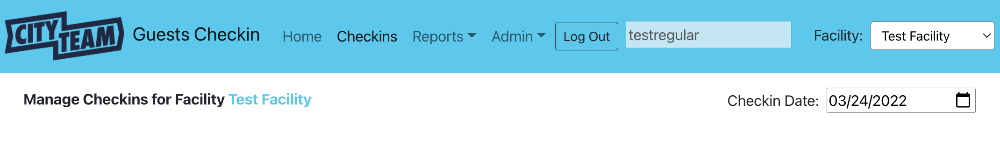
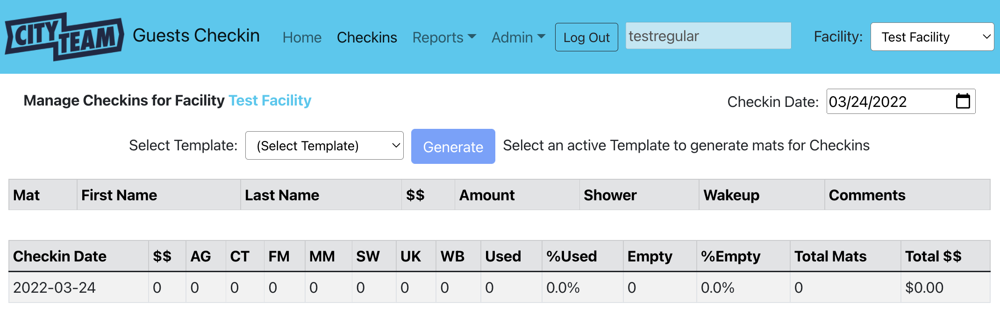
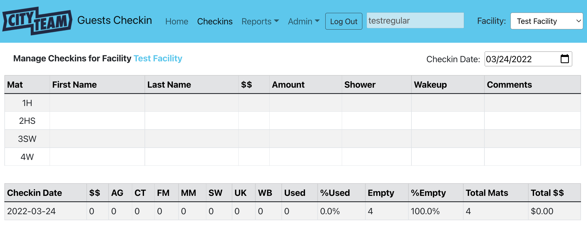

[Home](./index.md) | [Introduction](./USER-introduction.md) | Starting the Day | [Checking In Guests](./USER-checkin.md) | [Adjusting Existing Checkins](./USER-adjust.md)

# Starting the Day

### Select the Checkins Option

In the navigation bar at the top of the screen, click the `Checkins` link.
You will be presented with the following page:

At the *Checkin Date* prompt, enter the date for which you wish to enter
checkins.  This will already be set to today's date, because that is the
most common need, but you can select a different day if (for example)
you wish to update information entered for a previous day.  To select
the day you want, simply press `Enter`.

### Generating Mats

The very first time you are entering information for a particular date,
you will need to generate the sleeping mats that will be assigned for
this evening.  How many mats to generate, and how they are numbered,
depends on a **template** that has been set up by your administrator.

The *(Select Template)* field is a dropdown, from which you can choose
the template that will be used tonight.  Your administrator will tell
you which one should be selected.  After you make your selection, click
the `Generate` button.

Now, the screen will show the mats that will be assigned for tonight,
along with totals (which will be updated automatically as you check in
guests to the various mats).

See [Checking In Guests](./USER-checkin.md) for the next steps.
